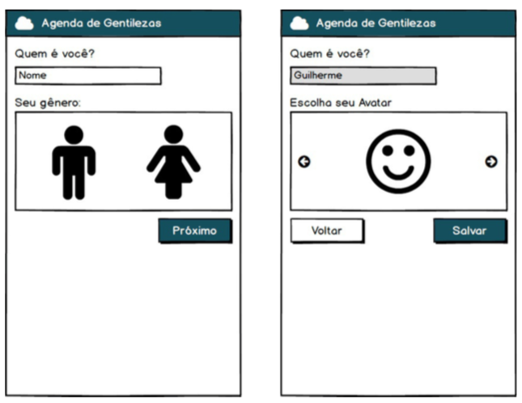

# [](#header-1) React App - JSX and Components

## [](#header-2) Sumário

1. Arquivos JSX
2. React components
3. BeHappy components
4. Colocando projeto no ar
5. Tarefa :P

## [](#header-2) 1. JSX (relembrando)

```jsx
import React, { Component } from "react";
import logo from "./logo.svg";
import "./App.css";

class App extends Component {
  render() {
    return (
      <div className="App">
        <header className="App-header">
          
          <h1 className="App-title">Welcome to React</h1>
        </header>
        <p className="App-intro">
          To get started, edit <code>src/App.js</code> and save to reload.
        </p>
      </div>
    );
  }
}

export default App;
```

## [](#header-2) 2. React Components (relembrando)


## [](#header-2) 3. BeHappy Components - colocando a mão na massa

**sumário** :

1. Goal
2. Protótipos de componentes
3. Componente App
4. Componente Header
5. Componente Novo Usuário
6. Componente Label

```sh
cd [nickname]/behappywith.me

git pull

git config --global --unset user.name
git config --global --unset user.email

git config user.name "Leonardo MINORA"
git config user.email "leonardo.minora@gmail.com"

mkdir src/css
git mv src/index.css src/css
curl https://unpkg.com/purecss@1.0.0/build/pure-min.css --output src/css/pure.css

pnpm install
pnpm start
```

[pure.css](http://purecss.io/)

### [](#header-3) 3.1. Goal



### [](#header-3) 3.2.Planning components


[Tamanho de telas](http://viewportsizes.com)

### [](#header-3) 3.3. App Component

1. `./src/App.js`
2. `./src/index.js`

**arquivo**: `./src/index.js`

```jsx
import React from "react";
import ReactDOM from "react-dom";
import "./css/index.css";
import "./css/pure.css";
import App from "./App";
import * as serviceWorker from "./serviceWorker";

ReactDOM.render(<App />, document.getElementById("root"));

// If you want your app to work offline and load faster, you can change
// unregister() to register() below. Note this comes with some pitfalls.
// Learn more about service workers: http://bit.ly/CRA-PWA
serviceWorker.unregister();
```

### [](#header-3) 3.4. Head Component


- **diretório** : `./src/components/Header`
- **arquivos** : `index.js`, `Header.js`, `index.css`, e `img/logo.png`

**arquivo** : `./src/components/Header/img/logo.png`


**arquivo** : `./src/components/Header/index.js`

```jsx
import Header from "./Header";

export default Header;
```

**arquivo** : `./src/components/Header/Header.js`

```jsx
import React from "react";

import "./index.css";

export default function Header() {
  return (
    <div className="header pure-menu pure-menu-horizontal pure-menu-fixed">
      <a href="/">
        
      </a>
      <h4 className="label">Agenda de gentileza</h4>
    </div>
  );
}
```

**arquivo** : `./src/components/Header/index.css`

```css
div.header {
  background-color: #2c80b9;
  min-width: 320px;
}

div.header img {
  display: block;
  margin: 0;
}

div.header img.logo {
  float: left;
  height: 92px;
  width: 164px;
}

div.header h4.label {
  color: #ffffff;
  font-weight: normal;
  line-height: 92px;
  float: left;
  margin: 0;
}

@media (max-width: 992px) {
  div.header img.logo {
    height: 78px;
    width: 139px;
  }
  div.header h4.label {
    line-height: 78px;
  }
}

@media (max-width: 600px) {
  div.header img.logo {
    height: 62px;
    width: 110px;
  }
  div.header h4.label {
    line-height: 62px;
  }
}
```

**arquivo** : `./src/App.js`

```jsx
import React, { Component } from "react";
import logo from "./logo.svg";

import "./App.css";
import Header from "./components/Header";

class App extends Component {
  render() {
    return (
      <div>
        <Header />
      </div>
    );
  }
}

export default App;
```

### [](#header-3) 3.5. NewUser Component

- **diretório** : `./src/components/NewUser`
- **arquivos** : `index.js`, e `NewUser.js`

**arquivo** : `./src/components/NewUser/index.js`

```jsx
import NewUser from "./NewUser";

export default NewUser;
```

**arquivo** : `./src/components/NewUser/NewUser.js`

```jsx
import React, { Component } from "react";

import Label from "../Label";

class NewUser extends Component {
  render() {
    return (
      <div className="center">
        <form className="pure-form pure-form-stacked">
          <p>Quem é você</p>
        </form>
      </div>
    );
  }
}

export default NewUser;
```

**arquivo** : `./src/App.js`

```jsx
import React, { Component } from "react";
import logo from "./logo.svg";

import "./App.css";
import Header from "./components/Header";
import NewUser from "./components/NewUser";

class App extends Component {
  render() {
    return (
      <div>
        <Header />
        <NewUser />
      </div>
    );
  }
}

export default App;
```

**arquivo** : `./src/css/index.css`

```css
body {
  margin: 0;
  padding: 0;
  font-family: sans-serif;
}

div.center {
  box-sizing: border-box;
  padding: 5px;
  display: table;
  margin: 0 auto;
  min-width: 320px;
  margin-top: 92px;
}

@media (max-width: 992px) {
  div.center {
    margin-top: 78px;
  }
}
@media (max-width: 600px) {
  div.center {
    margin-top: 62px;
  }
}
```

### [](#header-3) 3.6. Label Component

**diretório** : `./src/components/Label`
**arquivos** : `index.js`, e `Label.js`

**arquivo** : `./src/components/Label/index.js`

```jsx
import Label from "./Label";

export default Label;
```

**arquivo** : `./src/components/Label/Label.js`

```jsx
import React from "react";

export default function Label(props) {
  const style = {
    color: props.invalidValue ? "#d50000" : "#444444"
  };

  return (
    <label style={style} htmlFor={props.htmlFor}>
      {props.text}
    </label>
  );
}
```

**arquivo** : `./src/components/NewUser.js`

```jsx
import React, { Component } from "react";

import Label from "../Label";

class NewUser extends Component {
  render() {
    return (
      <div className="center">
        <form className="pure-form pure-form-stacked">
          <Label htmlFor="name" text="Quem é você?" />
        </form>
      </div>
    );
  }
}

export default NewUser;
```

## [](#header-2) 4. Heroku

1. Publicar no GitHub
2. Instalar no Heroku

```sh
git add src
git commit -m "Aula sobre componentes Reat"
git push
```

[heroku app](http://heroku.com/)

## [](#header-2) 5. Homework

**Just do it!!!**
