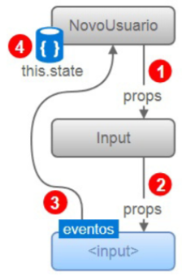
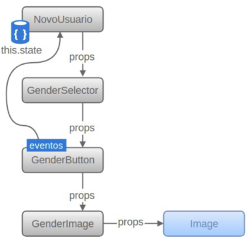

# [](#header-1) React App - State

## [](#header-2) Objetivos

- React
  - Entender o funcionamento de estado de um componente
- BeHappy.Me
  - Criar os componentes: Input, GenderButton, GenderImage, GenderSelector
  - Modificar os componentes: App, NewUser


## [](#header-2) Sumário

1. Estado de Componentes React
2. Um pouco de javascript
3. Preparando para programar
4. BeHappy.Me Component Input
5. BeHappy.Me Component Image e GenderImage
6. BeHappy.Me Component GenderButton e GenderSelector
7. Registrando as mudanças
8. Publicando no Heroku


## [](#header-2) 1. Estado de Componentes React


**Estado, valores**
- Expressos como objeto javascript ```{attr1: value, attr2: value}```
- Inicializados no método ```constructor```
- Modificados no método ```setState```

### [](#header-3) Exemplo

**src/App.js**

```jsx
class App extends React.Component {
  constructor(props) {
    super(props);
    this.state = {
      cor: white,
      contador: 0
    };
  }

  trocarCor = (e) => {
    let contador = this.state.contador;
    let cor = (++contador % 2) == 0 ? 'red': 'blue';
    this.setState({
      cor: cor,
      contador: contador
    });
  }

  render() {
    const estilo = {
      padding: 10,
      background: this.state.cor,
    }
    return (
      <h1 style={estilo} onClick={this.trocarCor}>
        {this.props.texto}
      </h1>
    );
  }
}
```

**src/index.js**

```jsx
import React from 'react';
import ReactDOM from 'react-dom';
import './index.css';
import App from './App';
import registerServiceWorker from './registerServiceWorker';

ReactDOM.render(
  <App texto="Olá mundo!" />,
  document.querySelector("root");
);
registerServiceWorker();
```


## [](#header-2) 2. Um pouco de javascript

### [](#header-3) **IO não bloqueante** (programação assíncrona e callback)
**primeiro exemplo**

```js
function funcaoNaoBloqueante(par, callback) {
  // API assíncrona de consulta ao servidor
  // Cria uma variável resultado
  callback(resultado);
}

let texto1 = funcaoBloqueante();
let texto2 = funcaoNaoBloqueante(texto1, function(variavel_resultado) { codigo });
funcaoBloqueante(texto2);
```

**segundo exemplo**

```js
const fs = require('fs');
var fileContent = '';

function sincrono() {
  fileContent = '';
  const someMath = 1 + 1;

  try {
    fileContent = fs.readFileSync('big-file.txt', 'utf-8');
    console.log('file has been read');
  } catch (err) {
    console.log(err);
  }
   
  const text = `The sum is ${ someMath }`;
  console.log(text);
  console.log(fileContent);
}

function assincrono() {
  fileContent = '';
  const someMatch = 1 + 1;
  
  fs.readFile('big-file.txt', 'utf-8', function (err, content) {
    if (err) {
      return console.log(err)
    }
    fileContent = content;
  });

  const text = `The response is ${ someMatch }`;
  console.log(text);
  console.log(fileContent);
}

sincrono();
assincrono();
```


### [](#header-3) **Arrow functions**

```js
function a(par) {
  // código
}

const b = function(par) {
  // código
}

// ARROW Function
const c = (par) => {
  // código
}
```

### [](#header-3) **Spread Operator** ```...```

```jsx
export default function Input(props) {
  return (
    <input
      type="text"
      id={props.id}
      placeholder={props.placeholder}
      maxLength={props.maxLength}
    />
  ); 
}

export default function Input(props) {
  return (
    <input
      type="text"
      {...props}
    />
  ); 
}
```


### [](#header-3) **Object.assign()**

```jsx
let aluno = {
  nome: 'Leonardo Minora',
  email: 'leonardo.minora@ifrn.edu.br'
};
console.log(aluno);
//{ nome: 'Leonardo Minora',
//  email: 'leonardo.minora@ifrn.edu.br' }

let novoAluno = Object.assign({matricula: '22958'}, aluno);
console.log(novoAluno);
// { matricula: '22958',
//   nome: 'Leonardo Minora',
//   email: 'leonardo.minora@ifrn.edu.br' }
```


### [](#header-3) **template string**

```js
console.log('auto ' + 2 * 3 * (-1) + 'px');
// auto -6px

console.log(`auto ${2 * 3 * (-1)}px`);
// auto -6px
```


## [](#header-2) 3. Preparando para programar
1. Abrir 2 terminais
2. Acessar ou clonar seu repositório ```cd $APP_DIR``` ou ```git clone```
  1. Se clonou, lembre de instalar as bibliotecas ```pnpm install```
3. Configurar o Git com seu nome e email  ```git config --global```
4. Download da figura que será utilizada pelos componentes
5. Lançar a aplicação web ```pnpm start``` 


- Executar no _Terminal 1_

```sh
### Tudo que iniciar com $ deverá ser substituído
### pelo valor correspondente

### se o código não estiver no seu computador, execute
### git clone $URL_REPOSITORIO
cd $APP_DIR
git pull

### Modifica informações do desenvolvedor
git config --global --replace-all user.name "$NOME"
git config --global --replace-all user.email "$EMAIL"

### download da imagem a ser utilizada nos componentes
mkdir public/img
curl https://github.com/tiipos/tiipos.github.io/raw/master/react/img/behappy/avatars.png --output public/img/avatars.png

### Instala as bibliotecas do app
pnpm install

### Inicia o App
pnpm start
```


## [](#header-2) 4. BeHappy.Me Component Input

**Características**
1. Um mecanismo para que os outros componentes obtenham o valor digitado;
2. Um atributo identificar;
3. Um valor de placeholder;
4. Um tamanho máximo de caracteres;
5. Um indicador para mostrar se é _read-only_ ou não;
6. Um indicador de que está ou não corretamente preenchido
7. Um valor padrão.



- executar no _terminal 2_

```sh
mkdir src/components/Input
touch src/components/Input/index.js
touch src/components/Input/Input.js
```


- editar com o VS Code **src/components/Input/index.js**

```jsx
import Input from './Input';

export default Input;
```


- editar com o VS Code **src/components/Input/Input.js**

```jsx
import React, {Component} from 'react';

export default function Input(props) {
  const style = {
    borderColor: props.invalidValue ? '#d50000' : '#cccccc',
    backgroundColor: props.invalidValue ? '#ffcdd2' : '#ffffff'
  }
  let properties = Object.assign({}, props);
  delete properties.invalidValue;

  return (
    <input
      type="text"
      style={style}
      {...properties}
    />
  ); 
}
```

- editar com o VS Code **src/components/NewUser.js**

```jsx
import React, {Component} from 'react';

import Label from '../Label';
import Input from '../Input';

class NewUser extends Component {
  constructor(props) {
    super(props);
    this.state = {
      user: {
        name: 'Minora'
      },
      validation: {
        invalidName: false
      }
    };
  }

  updateUserName = (event) => {
    let user = this.state.user;
    user.name = event.target.value;
    this.setState({
      user: user
    });
  }

  render() {
    return (
      <div className="center">
        <form className="pure-form pure-form-stacked">
          <Label 
              htmlFor="name" 
              text="Quem é você?" 
              invalidValue={this.state.validation.invalidName} />
          <Input 
              id="name" 
              placeholder="Digite seu nome" 
              maxLength="40" 
              readOnly={false}
              invalidValue={this.state.validation.invalidName}
              defaultValue={this.state.user.name}
              onChange={this.updateUserName} />
        </form>
      </div>
    );
  }
}

export default NewUser;
```

- **Visualizar o resultado no browser**

## [](#header-2) 5. BeHappy.Me Component Image e GenderImage




**lógica**
1. Um mecanismo para que os outros componentes obtenham o valor;
2. Um gênero selionado;
3. Um indicador de que está ou não corretamente preenchido;
4. Um indicador de seleção de gênero selecionado.


**Sprites**

- Referências
  - [W3C CSS Image Sprites](https://www.w3schools.com/css/css_image_sprites.asp)
  - [Utilizando CSS sprites para otimizar o carregamento de imagens em seu site](https://www.hostgator.com.br/blog/css-sprites-para-otimizar-imagens-em-seu-site/)
- Ferramentas
  - [SpriteCow](http://www.spritecow.com)
  - [CSS Sprites](http://css.spritegen.com)
  - [CSS Sprite Generator](https://spritegen.website-performance.org)
  - [CSS Sprite tool](http://cssspritestool.com)


### [](#header-3) Image

- executar no _terminal 2_

```sh
mkdir src/components/Image
touch src/components/Image/index.js
touch src/components/Image/Image.js
```


- editar com o VS Code **src/components/Image/index.js**

```jsx
import Image from './Image';

export default Image;
```


- editar com o VS Code **src/components/Image/Image.js**

```jsx
import React, {Component} from 'react';

class Image extends Component {
  // constructor(props) {
  //   super(props);
  // }

  calcPositionX = () => {
    return this.props.x * this.props.width * (-1) + 'px';
  }

  calcPositionY = () => {
    return `${this.props.y * this.props.height * (-1)}px`;
  }

  calcSize = () => `auto ${this.props.backgroundHeight}px`

  calcStyle = () => {
    return {
      backgroundImage: `url(${this.props.file})`,
      backgroundPositionX: this.calcPositionX(),
      backgroundPositionY: this.calcPositionY(),
      width: `${this.props.width}px`,
      height: `${this.props.height}px`,
      display: 'table',
      margin: '0 auto'
    };
  }

  render() {
    return (
      <div style={this.calcStyle()}></div>
    );
  }
}

export default Image;
```


### [](#header-3) GenderImage

- executar no _terminal 2_

```sh
mkdir src/components/GenderImage
touch src/components/GenderImage/index.js
touch src/components/GenderImage/GenderImage.js
```


- editar com o VS Code **src/components/GenderImage/index.js**

```jsx
import GenderImage from './GenderImage';

export default GenderImage;
```


- editar com o VS Code **src/components/GenderImage/GenderImage.js**

```jsx
import React from 'react';

import Image from '../Image';

export default function GenderImage(props) {
  return (
    <Image 
        x={0}
        y={(props.gender === 'm') ? 0 : 1}
        width={170}
        height={170}
        backgroundHeight={340}
        file="img/avatars.png"
    />
  );
}
```


### [](#header-3) Visualizando o resultado

- editar com o VS Code **src/components/NewUser/NewUser.js**

```jsx
import React, {Component} from 'react';

import Label from '../Label';
import Input from '../Input';
import GenderImage from '../GenderImage';

class NewUser extends Component {
  constructor(props) {
    super(props);
    this.state = {
      user: {
        name: 'Minora'
      },
      validation: {
        invalidName: false
      }
    };
  }

  updateUserName = (event) => {
    let user = this.state.user;
    user.name = event.target.value;
    this.setState({
      user: user
    });
  }

  render() {
    return (
      <div className="center">
        <form className="pure-form pure-form-stacked">
          <Label 
              htmlFor="name" 
              text="Quem é você?" 
              invalidValue={this.state.validation.invalidName} />
          <Input 
              id="name" 
              placeholder="Digite seu nome" 
              maxLength="40" 
              readOnly={false}
              invalidValue={this.state.validation.invalidName}
              defaultValue={this.state.user.name}
              onChange={this.updateUserName}
          />
          <GenderImage gender="m" />
          <GenderImage gender="f" />
        </form>
      </div>
    );
  }
}

export default NewUser;
```

- **Visualizar o resultado no browser**


## [](#header-2) 6. BeHappy.Me Component GenderButton e GenderSelector

### [](#header-3) GenderButton

- executar no _terminal 2_

```sh
mkdir src/components/GenderButton
touch src/components/GenderButton/index.js
touch src/components/GenderButton/index.css
touch src/components/GenderButton/GenderButton.js
```


- editar com o VS Code **src/components/GenderButton/index.js**

```jsx
import GenderButton from './GenderButton';

export default GenderButton;
```

- editar com o VS Code **src/components/GenderButton/index.css**

```css
a.gender-button {
  box-sizing: border-box;
  width: 180px;
  height: 180px;
  border-radius: 10px;
  margin: 3px;
  padding-top: 5px;
  display: inline-block;
}

a.gender-button:hover{
  background-color: #dbdbdb;
}

a.selected-gender-button {
  background-color: #00C853;
}

a.selected-gender-button:hover {
  background-color: #00C853;
}
```


- editar com o VS Code **src/components/GenderButton/GenderButton.js**

```jsx
import React from 'react';

import './index.css';
import GenderImage from '../GenderImage';

export default function GenderButton(props) {
  return (
    <a 
      className={props.selected ? 
        "gender-button selected-gender-button" : 
        "gender-button"
      }
      href="#!"
      onClick={event => props.updateGender(event, props.gender)}
    >
      <GenderImage gender={props.gender} />
    </a>
  );
}
```


### [](#header-3) GenderSelector

- executar no _terminal 2_

```sh
mkdir src/components/GenderSelector
touch src/components/GenderSelector/index.js
touch src/components/GenderSelector/GenderSelector.js
```


- editar com o VS Code **src/components/GenderSelector/index.js**

```jsx
import GenderSelector from './GenderSelector';

export default GenderSelector;
```


- editar com o VS Code **src/components/GenderSelector/GenderSelector.js**

```jsx
import React from 'react';

import GenderButton from '../GenderButton';

export default function GenderSelector(props) {
  const male = props.gender === "m";
  const female = props.gender === "f";
  const cor = props.invalidValue ? '#d50000' : '#cccccc';
  const style = {
    boxSizing: 'border-box',
    border: `1px solid ${cor}`,
    borderRadius: '5px',
    padding: '3px',
    paddingBottom: '0'
  };
 
  return (
    <div style={style}>
      <GenderButton
        selected={female}
        gender={'f'}
        updateGender={props.updateGender}
      />
      <GenderButton
        selected={male}
        gender={'m'}
        updateGender={props.updateGender}
      />
    </div>
  );
}
```


### [](#header-3) Visualizar o resultado

- editar com o VS Code **src/components/NewUser/NewUser.js**

```jsx
import React, {Component} from 'react';

import Label from '../Label';
import Input from '../Input';
import GenderSelector from '../GenderSelector';

class NewUser extends Component {
  constructor(props) {
    super(props);
    this.state = {
      user: {
        name: '',
        gender: ''
      },
      validation: {
        invalidName: false,
        invalidGender: false
      }
    };
  }

  updateUserName = (event) => {
    let user = this.state.user;
    user.name = event.target.value;
    this.setState({
      user: user
    });
  }

  updateUserGender = (event, gender) => {
    event.preventDefault();
    let user = this.state.user;
    user.gender = gender;
    this.setState({
      user: user
    });
  }

  render() {
    return (
      <div className="center">
        <form className="pure-form pure-form-stacked">
          <Label 
              htmlFor="name" 
              text="Quem é você?" 
              invalidValue={this.state.validation.invalidName} />
          <Input 
              id="name" 
              placeholder="Digite seu nome" 
              maxLength="40" 
              readOnly={false}
              invalidValue={this.state.validation.invalidName}
              defaultValue={this.state.user.name}
              onChange={this.updateUserName}
          />
          <Label
            text="Seu gênero:"
            invalidValue={this.state.validation.invalidGender}
          />
          <GenderSelector
            invalidValue={this.state.validation.invalidGender}
            gender={this.state.user.gender}
            updateGender={this.updateUserGender}
          />
        </form>
      </div>
    );
  }
}

export default NewUser;
```

- **Visualizar o resultado no browser**


## [](#header-2) 7. Registrando as mudanças

1. Fechar servidor web ```CTRL + C```
2. Adicioanar novos e modificados arquivos (```git add```) no repositório local
3. Registrar mudanças (```git commit```) no repositório local
4. Publicar mudanças no repositório remoto (```git pull``` e ```git push```)


- Executar no _Terminal 1_

```sh
### 1. Pressionar CTRL+C para fechar o servidor 
### 

### 2. Adicionar arquivos novos e modificados no repositório local
git add src/components public/img/avatars.png

### 3. Registrar mudanças no repositório local
git commit -m "$MSG"

### Publicar as mudanças no repositório remoto
git pull
git push
```

## [](#header-2) 8. Publicando no Heroku

1. Acessar o [Heroku](https://www.heroku.com) e se autenticar
2. Acessar o link do seu _App_ no Heroku
3. No _dashboard_ do seu _App_, clicar na aba _Deploy_
4. Em _Deployment method_, selecionar GiHub
5. Definir qual o repositório esta o _App_
6. Em _Manual deploy_, clicar em _Deploy Branch_
7. Aguardar um tempo, olhando o log
8. No topo da página, clicar em _Open App_
